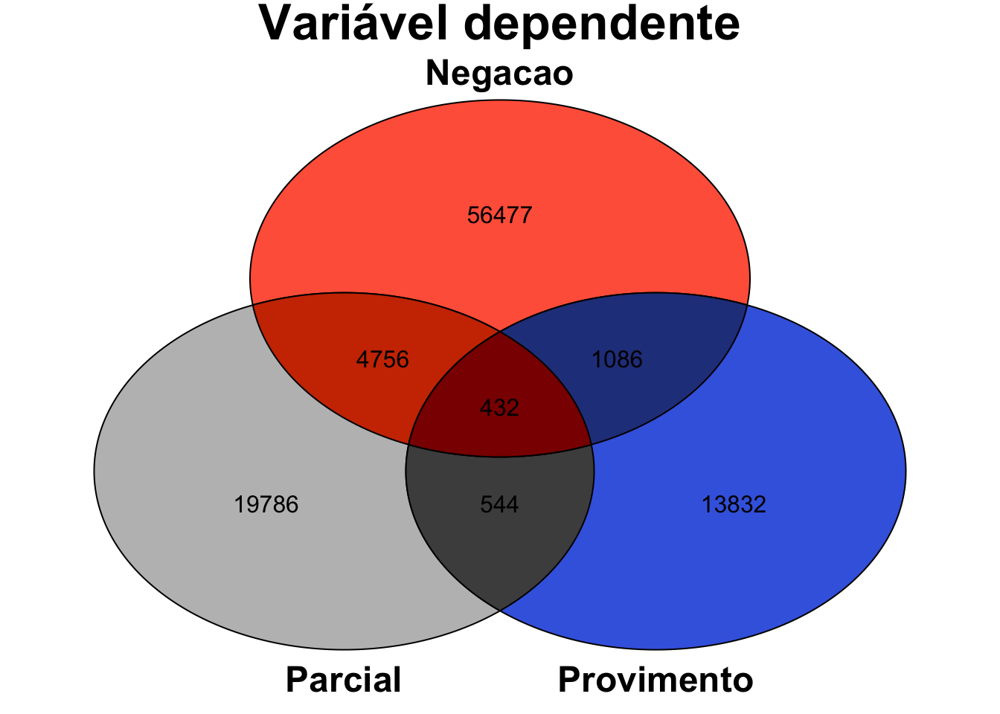

<!-- README.md is generated from README.Rmd. Please edit that file -->

# plotVenn 


## Installation

1 - From the CRAN repository:

``` r
  install.packages('plotVenn', dep=TRUE)

  library(plotVenn)
```

2 - To get the current development version from Github:

``` r
## install devtools package if it's not already
if (!requireNamespace("devtools", quietly = TRUE)) {
  install.packages("devtools")
}

install_github("danielmarcelino/plotVenn")

library(plotVenn)
```

## Getting help

If you encounter a bug, please file a minimal reproducible example using
[reprex](https://reprex.tidyverse.org/index.html)
For public questions and clarifications,
[StackOverflow](https://stackoverflow.com/) is a good place to ask.

## Helping out

**plotVenn** is intended to be useful for the 
community; contributions are very welcome\! Feel free to submit a [pull
request](https://github.com/danielmarcelino/plotVenn/pulls).

## Usage

For a brief introduction to **plotVenn** functionality, run:

``` r
demo(plotVenn)
```

To see what functions are implemented in **plotVenn**, run:

``` r
help(package=plotVenn)
```